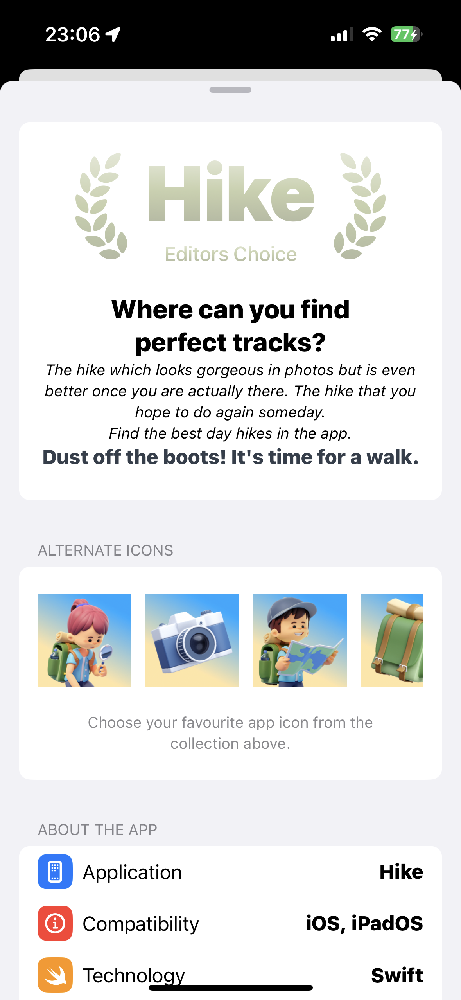

# 01 - Hike App
Hike is a SwiftUI project I built following the "SwiftUI + SwiftData Masterclass" course. It serves as a practice project to experiment with SwiftUI components, animations, and design elements. While the core functionality follows the course, I applied my own custom design updates to modernize the UI and bring in a personal style.

## Features

- **Custom Card Component**: Displays hiking-related information with smooth animations and a clean, modern design.
- **Custom Button Style**: Includes gradient backgrounds and subtle shadow animations for a polished look.
- **Motion Animation**: Used to bring fluidity to transitions and actions in the app.
- **Sheet Presentation**: A settings sheet with multiple presentation styles (medium and large) triggered by a button.
- **List with Sections and Labeled Content**: Organized UI components using SwiftUI's `List`, `Section`, and `LabeledContent`.
- **Alternate App Icons**: Supports dynamic app icon switching via the app's settings.

## Screenshots

### New Design
I customized the design to give the app a modern, flat look. Here are the updated UI elements with my personal touch:

### Original Design
These screenshots show the app's original design before my custom updates:

### App Icon
The app supports alternate app icons, allowing users to switch between different designs:

## Conclusion
Through building the Hike app, I deepened my understanding of SwiftUI animations and learned how to create custom button styles, which was new to me.
The alternate app icon feature was particularly interesting, as it added a unique layer of customization that I had not explored before.
