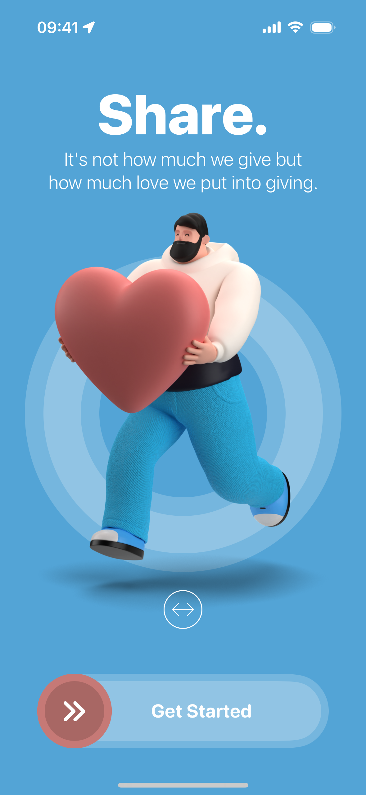
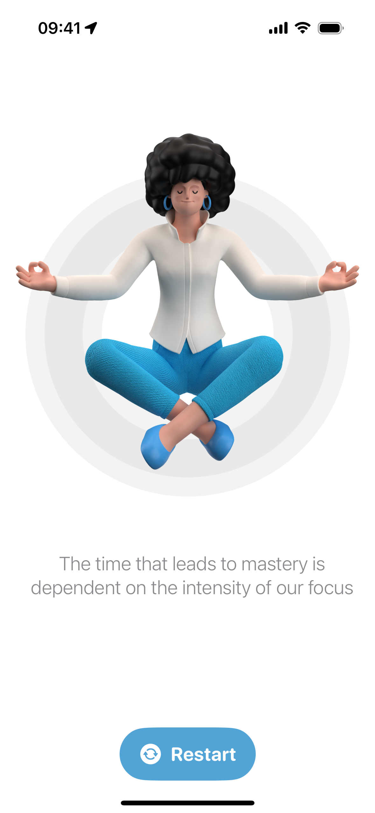

# Restart App

The **Restart App** is a SwiftUI-based application that delivers a clean and interactive user experience through its well-designed onboarding flow, animations, and media integration. It incorporates several iOS-specific features, such as haptic feedback and audio playback, to create a more immersive and responsive app.

---

## Features

- **Custom Loading Screen & App Settings**  
  The app starts with a custom loading screen, designed with user-specific background color settings. It utilizes **AppStorage** to store and retrieve these preferences across app launches, providing a personalized experience.

- **Onboarding Flow**  
  A beautiful and smooth onboarding flow introduces users to the app, guiding them through essential features with an easy-to-understand interface. The onboarding screen is also equipped with **drag gestures**, adding an interactive element to the user journey.

- **Home Screen Design**  
  The home screen is designed with simplicity and functionality in mind, ensuring that users can navigate the app effortlessly. The interface maintains a consistent color scheme, keeping the **status bar** always bright using `.preferredColorScheme(.dark)`.

- **Smooth Animations**  
  The app employs fluid **SwiftUI animations** to enhance transitions and make the interaction more engaging. Every screen is designed with thoughtful animations, contributing to a delightful user experience.

- **AVFoundation Audio Integration**  
  Audio cues are seamlessly integrated throughout the app using **AVFoundation**. The **AudioPlayer** implementation allows the app to play sound files, making the user interaction more dynamic.

- **Haptic Feedback**  
  To make interactions even more engaging, **Haptic Feedback** has been incorporated, delivering subtle vibrations that correspond to user actions, providing a tactile response that complements the visual design.

---

## Technology Stack

- **SwiftUI**: For designing the user interface, interactions, and animations.
- **AppStorage**: To store and retrieve user settings such as custom background colors.
- **AVFoundation**: For handling audio playback with smooth integration.
- **Haptic Feedback**: To provide tactile responses for a more immersive experience.

---

## Screenshots

  
    
    

---

## What I Learned

In developing the Restart App, I deepened my understanding of **SwiftUI animations**, applying them in more complex scenarios to create smooth and dynamic interactions. One of the new concepts I explored in this project was **AVFoundation**, which I used to implement an audio player that enhances the user experience with sound effects.

While I had previous experience with **haptic feedback** and **AppStorage**, this project allowed me to further refine their integration into the app, ensuring a seamless user experience when handling preferences and providing tactile feedback. This project was a valuable opportunity to build on my prior knowledge while exploring new multimedia capabilities.

