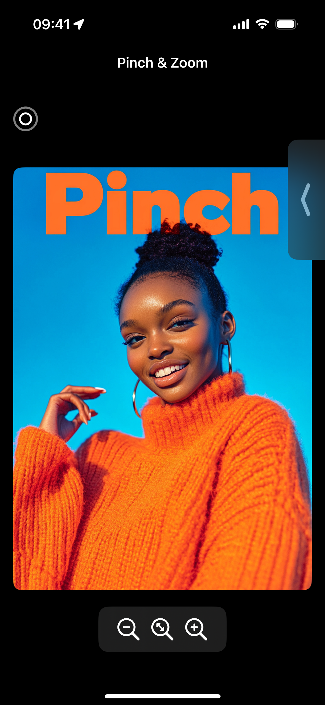

# Pinch App

The **Pinch App** is a SwiftUI-based application that demonstrates advanced pinch and zoom interactions, utilizing the rich capabilities of SwiftUI gestures. The app is designed to be intuitive and engaging, making it ideal for both iPhone and iPad platforms. By working on this project, I delved into gesture handling, material design, and enhanced visual elements with SF Symbols, offering users a polished, modern UI.

## Features

- **Pinch & Zoom Gestures**: Integrate dynamic pinch and zoom functionality using the **magnification gesture** in SwiftUI. This enables users to intuitively zoom in and out of content.
- **Comprehensive Gesture Recognition**: Explore SwiftUI’s gesture ecosystem, incorporating:
  - Long-Press Gesture (enhanced with **haptic feedback**)
  - Double-Tap Gesture
  - Drag Gesture
  - Magnification Gesture (central to the pinch and zoom functionality)

- **SwiftUI Materials**: Add layers of depth and interactivity to your app using **SwiftUI's Material** design, allowing for translucent and vibrant backgrounds that react dynamically with other UI elements.
- **SF Symbols Integration**: Although I was already familiar with SF Symbols, they continue to play a key role in the app’s polished design. Symbols are rendered using multiple modes such as **hierarchical**, **palette**, and **multicolor** for a visually enhanced interface.

## Personal Touches

- The images used in this app were created using **MidJourney**, adding a unique and personalized visual element to the app.
- Added **haptic feedback** for the **long-press gesture**, enhancing the tactile experience of the interaction.
- Implemented **String(format: "%.2f", value)** to display pinch zoom values with two decimal precision.
- Smoothly animated the display of number changes during pinch and zoom, improving the user interface's fluidity.

## Screenshots

  
    
    
    

## What I Learned
- **SwiftUI Materials**: Working with SwiftUI materials allowed me to create visually appealing backgrounds that seamlessly blend with other UI elements. This was an exciting new feature to explore.
- **Pinch & Zoom Features**: The challenge of creating smooth and responsive pinch and zoom interactions honed my understanding of SwiftUI’s magnification gesture. It was rewarding to see how the app became more interactive as a result.
- **SwiftUI Gestures**: While I had some experience with gestures before, this project gave me a more in-depth understanding of how to combine multiple gestures effectively within the same UI.

## Conclusion

The **Pinch App** was a fantastic opportunity to dive deep into SwiftUI’s gesture handling and materials. With interactive gestures and a modern, vibrant UI, the app is both engaging and educational. This project helped me solidify important concepts that I can apply to future iOS apps. Whether for iPhone or iPad, the **Pinch App** provides a refined and responsive user experience that highlights the power of SwiftUI.
